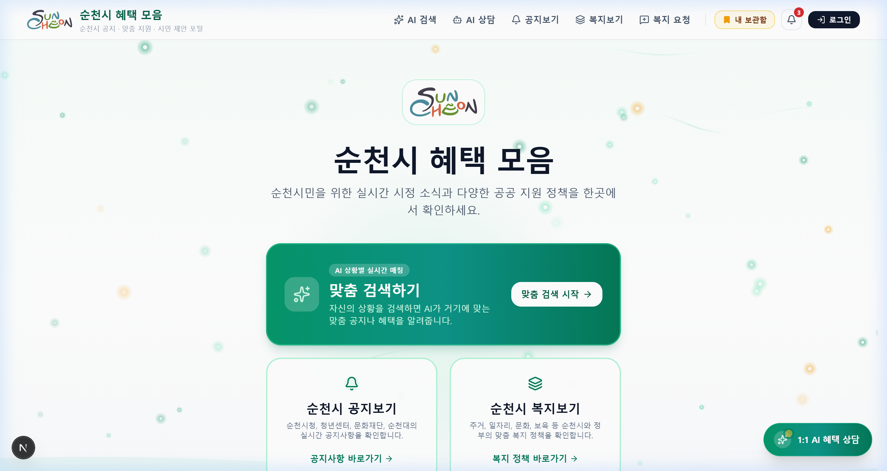

# 순천시 혜택 모음 (Suncheon Benefits Portal)

> **순천시민과 청년을 위한 실시간 시정 소식 및 맞춤형 공공 복지·지원 정책 통합 안내 포털**  
> AI 기반의 상황별 실시간 맞춤 검색, 1:1 AI 혜택 상담 비서, 정부24 지원 정책 정밀 크롤링 및 필수 구비서류 자동 분석·연동 서비스를 제공합니다.

---

## 서비스 화면 (Preview)



---

## 핵심 기능 (Key Features)

### 1. AI 상황별 실시간 맞춤 검색 (`/custom-search`)
- **자연어 조건 입력**: 연령, 주거, 소득/경제 상황, 취업/창업 고민 등 시민의 일상적인 상황을 입력하면 150여 건 이상의 정책 및 공지사항 중 가장 적합한 혜택을 실시간 매칭합니다.
- **AI 종합 진단 및 로드맵**: Google Gemini AI가 신청 우선순위, 지원 자격 요건 충족 여부, 추천 사유 및 단계별 실행 가이드를 제시합니다.
- **인터랙티브 캔버스 로딩 미니게임**: 분석 대기 시간 동안 지루하지 않도록 HTML5 Canvas 기반의 '순천 혜택 버블 팡팡' 물리 파티클 미니게임을 제공합니다.

### 2. 1:1 AI 혜택 상담 챗봇 (`ChatbotModal`, `/chat`)
- **실시간 행정 전문 AI 비서**: 플로팅 버튼 또는 메뉴를 통해 언제 어디서나 복지 및 시정 공고에 대해 질문할 수 있습니다.
- **맞춤 상담**: 지원 자격, 신청 기간, 접수 방법, 필요한 서류, 소관 부서 연락처 등을 시민의 눈높이에 맞춰 친절하고 명쾌하게 안내합니다.

### 3. 정부24 & 공공데이터 정밀 크롤링 및 AI 3줄 요약 (`/policies`, `/api/summarize`)
- **정부24(보조금24) 심층 연동**: 정부24 공식 공고 페이지(`gov.kr/portal/rcvfvrSvc/dtlEx/{id}`)에서 `신청방법`, `신청기간`, `민원인이 제출해야 하는 구비서류`, `담당공무원 확인 서류`를 실시간 정밀 크롤링합니다.
- **서류 제출 불필요(해당없음) 자동 식별**: 온라인 신청 시 전산망으로 자격이 자동 확인되는 정책(예: 청년 국가기술자격시험 응시료 지원 등)은 불필요한 서류 안내 없이 '서류 제출 불필요' 전용 카드와 공식 신청 바로가기 링크를 제공합니다.
- **필수 서류 원클릭 온라인 발급 연동**: 구비서류 제출이 필요한 정책의 경우, 주민등록등본, 가족관계증명서, 소득금액증명원, 위택스(지방세), 홈택스 등 공식 민원 발급 포털 직통 링크를 제공합니다.

### 4. 순천시 실시간 공지사항 크롤링 및 DB 동기화 (`/notices`, `/api/crawl`)
- **실시간 다채널 수집**: 순천시청, 순천청년센터, 순천문화재단, 국립순천대학교 등의 최신 공지사항을 수집합니다.
- **초고속 응답 최적화**: Supabase DB-First 우선 응답과 In-flight 중복 요청 차단 캐시를 결합하여 100ms 이내 초고속 로딩을 실현했습니다.
- **자동 동기화 스케줄러**: 매일 최신 시정 소식을 자동으로 수집·갱신합니다.

### 5. 알림 센터 & 키워드 맞춤 알림 (`NotificationCenter`)
- **맞춤 키워드 구독**: 청년, 주거, 일자리, 월세, 창업, 육아, 어르신 등 관심 키워드를 설정할 수 있습니다.
- **실시간 알림**: 설정한 관심 분야와 키워드에 부합하는 새로운 공고가 등록되면 즉시 알림 뱃지와 목록으로 안내합니다.

### 6. 내 보관함 & 마이페이지 (`/bookmarks`, `/mypage`)
- **관심 정책 북마크**: 마음에 드는 정책과 공지사항을 저장하고, 필터링·검색 및 AI 요약을 확인할 수 있습니다.
- **회원 프로필 및 관심사 관리**: 거주 읍·면·동 설정, 관심 복지 카테고리 관리, 비밀번호 변경 등을 지원합니다.
- **간편 로그인/회원가입**: 이메일 인증 발송 대기 없이 즉각적이고 안전하게 가입 및 로그인이 가능합니다.

### 7. 시민제안 게시판 (`/support`)
- 순천시민이 직접 필요한 복지 정책이나 시정 개선 아이디어를 등록하고, 다른 시민들과 공감(좋아요)을 나눌 수 있는 참여형 공간입니다.
- '접수완료', '검토중', '시정반영' 등 제안의 진행 상태를 투명하게 제공합니다.

---

## 기술 스택 (Tech Stack)

### Frontend
- **Framework**: Next.js 16 (App Router), React 19, TypeScript
- **Styling**: Tailwind CSS, CSS Animations
- **Icons & Graphics**: Lucide React, HTML5 Canvas API (파티클 물리 엔진)
- **UI Components**: 커스텀 모달, 토스트 알림, 인앱 알림 센터, 탭/필터링 시스템

### Backend & Data
- **Server**: Next.js API Routes (Serverless Functions), Node.js (v24)
- **Database**: Supabase (PostgreSQL, Row Level Security)
- **Web Scraping**: Cheerio, Node Fetch, REST API Integration
- **Server Cache**: 메모리 캐시 및 DB-First SWR 캐싱 구조

### AI & External APIs
- **LLM**: Google Gemini API (`gemini-3.5-flash`, `gemini-3.6-flash`, `gemini-flash-latest`)
- **Public Open APIs**:
  - 대한민국 행정안전부 정부24 (보조금24 API & 웹 상세 서비스)
  - 고용노동부 / 한국고용정보원 온통청년(청년정책포털 API)
  - 공공데이터포털(odcloud.kr) 공공서비스 목록 및 상세정보 API

---

## 디렉토리 구조 (Project Structure)

```text
oss_AI_hackathon/
├── public/                     # 정적 에셋 및 스크린샷
│   ├── images/
│   │   └── homepage_preview.png # 메인 화면 스크린샷
│   └── suncheon-logo.svg       # 순천시 심볼 로고
├── src/
│   ├── app/                    # Next.js App Router 페이지
│   │   ├── api/                # API 엔드포인트
│   │   │   ├── chat/           # 1:1 AI 상담 API
│   │   │   ├── crawl/          # 공지사항 실시간 크롤링 API
│   │   │   ├── match/          # AI 맞춤 매칭 API
│   │   │   ├── policies/sync/  # 정책 동기화 API
│   │   │   └── summarize/      # 정부24 서류 분석 AI 요약 API
│   │   ├── bookmarks/          # 내 보관함 페이지
│   │   ├── custom-search/      # AI 상황별 맞춤 검색 페이지
│   │   ├── login/              # 로그인 / 회원가입 페이지
│   │   ├── mypage/             # 마이페이지
│   │   ├── notices/            # 실시간 공지사항 목록 페이지
│   │   ├── policies/           # 공공 지원 정책 목록 페이지
│   │   └── support/            # 시민제안 게시판 페이지
│   ├── components/             # 재사용 가능한 React 컴포넌트
│   │   ├── AiLoadingCanvas.tsx # 혜택 버블 팡팡 인터랙티브 미니게임
│   │   ├── AiSummaryModal.tsx  # 정부24 구비서류 연동 AI 요약 모달
│   │   ├── BookmarkSection.tsx # 보관함 뷰 컴포넌트
│   │   ├── ChatbotModal.tsx    # 1:1 AI 혜택 상담 플로팅 챗봇
│   │   ├── Navbar.tsx          # 상단 글로벌 네비게이션
│   │   ├── NotificationCenter.tsx # 키워드 기반 실시간 알림 센터
│   │   ├── PolicySection.tsx   # 지원 정책 목록 및 필터링
│   │   ├── SuncheonWindCanvas.tsx # 메인 갈대바람 배경 캔버스
│   │   └── SupportSection.tsx  # 시민제안 CRUD 컴포넌트
│   └── lib/                    # 유틸리티 및 핵심 라이브러리
│       ├── api.ts              # 정부24 및 온통청년 데이터 수집 모듈
│       ├── chatbot.ts          # Gemini AI 챗봇 컨텍스트 관리
│       ├── crawler.ts          # 순천시 주요 기관 공지 크롤러
│       ├── gov24Documents.ts   # 정부24/대법원/국세청 공식 발급처 매핑
│       ├── matcher.ts          # 상황별 AI 정책 매칭 알고리즘
│       ├── notifications.ts    # 알림 스토리지 및 키워드 감지 엔진
│       ├── summarizer.ts       # 정부24 구비서류 정밀 크롤러 및 요약 엔진
│       └── supabase.ts         # Supabase 클라이언트 설정
├── supabase_schema.sql         # Supabase DB 스키마 및 RLS 정의
└── package.json
```

---

## 실행 방법 (Getting Started)

### 1. 패키지 설치
```bash
npm install
```

### 2. 환경 변수 설정 (`.env.local`)
```env
# Supabase
NEXT_PUBLIC_SUPABASE_URL=your_supabase_url
NEXT_PUBLIC_SUPABASE_ANON_KEY=your_supabase_anon_key

# Google Gemini API
GEMINI_API_KEY=your_gemini_api_key

# 공공데이터 API
PUBLIC_DATA_API_KEY=your_public_data_api_key
YOUTH_CENTER_API_KEY=your_youth_center_api_key

# 포트 설정
PORT=3102
```

### 3. 개발 서버 실행
```bash
npm run dev
```

브라우저에서 [http://localhost:3102](http://localhost:3102) 접속하여 확인합니다.
